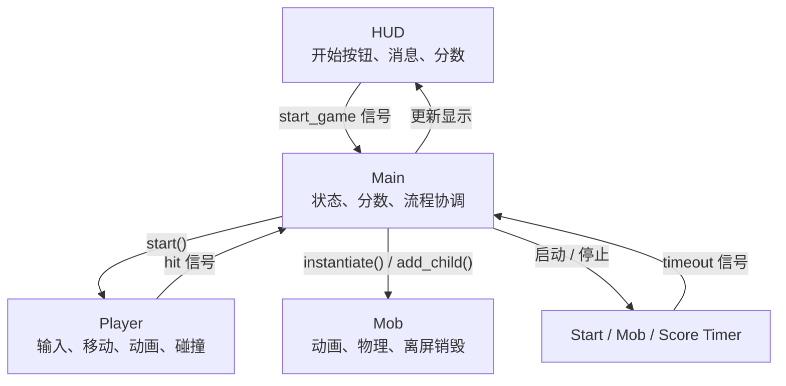

# Godot-你的第一个2D游戏

## 来源
- [你的第一个 2D 游戏](https://docs.godotengine.org/zh-cn/4.x/getting_started/first_2d_game/index.html)
- 结构核对：[Player 代码](https://docs.godotengine.org/zh-cn/4.x/getting_started/first_2d_game/03.coding_the_player.html)、[Main 场景](https://docs.godotengine.org/zh-cn/4.x/getting_started/first_2d_game/05.the_main_game_scene.html)、[HUD](https://docs.godotengine.org/zh-cn/4.x/getting_started/first_2d_game/06.heads_up_display.html)
- 提炼依据：[[2026-07-10]]、[[2026-07-11]]

## 最终成果
- 完成一个可重开的躲避类游戏：玩家躲避持续生成的敌人，生存时间转化为分数，碰撞后结束游戏并返回开始界面。
- 跑通了输入、动画、碰撞、场景实例化、计时器、HUD 和信号共同组成的完整游戏循环。

## 整体结构


- **Player（`Area2D`）**：读取 Input Map，计算并归一化移动向量，用 `delta` 更新位置，用 `clamp()` 限制在屏幕内，并根据方向播放动画。碰到敌人后隐藏、禁用碰撞并发出 `hit`。
- **Mob（`RigidBody2D`）**：负责自己的动画和物理运动；离开屏幕后通过 `screen_exited` 调用 `queue_free()`。出生位置、方向和速度由 Main 决定。
- **Main（`Node`）**：游戏状态中心，拥有分数、三个 Timer、出生路径和 Mob 场景资源；负责开始、刷怪、计分、结束和重开。
- **HUD（`CanvasLayer`）**：只负责显示分数和消息、收集开始意图；它不拥有游戏状态。按钮被按下后发出 `start_game`，由 Main 决定如何开始游戏。
- **三个 Timer**：`StartTimer` 提供开始前的缓冲，随后启动 `MobTimer` 和 `ScoreTimer`；后两者分别驱动刷怪和计分。

## 运行流程
1. 游戏启动时显示标题和开始按钮，Player 在自己的 `_ready()` 中调用 `hide()`；最终版本不会自动调用 `new_game()`。
2. 点击按钮或使用快捷键后，HUD 发出 `start_game`，Main 执行 `new_game()`：清零分数、清理上一局敌人、重置 Player、更新 HUD，并启动 `StartTimer`。
3. `StartTimer` 到期后启动刷怪与计分。`MobTimer` 每次到期都由 Main 实例化一个 Mob，并用 `PathFollow2D` 随机选择出生位置、方向和速度。
4. Player 每帧读取输入并移动；`ScoreTimer` 每次到期都由 Main 增加分数并通知 HUD 更新显示。
5. Player 碰到 Mob 后发出 `hit`。Main 停止刷怪和计分，HUD 显示 Game Over，随后回到开始界面。
6. 仍在屏幕内的旧敌人不会在 `game_over()` 中统一消失，而是在下一次 `new_game()` 中按 `mobs` 分组清理。

## 关键概念
- **[[Godot-输入动作与Input Map|输入动作与 Input Map]]**：代码读取 `move_left` 等逻辑动作，不直接依赖某个物理按键。
- **[[Godot-帧率无关的二维移动|帧率无关的二维移动]]**：归一化避免手工组合的斜向输入更快；速度乘以 `delta` 得到本帧位移。
- **[[Godot-节点、场景与场景树|节点引用与场景实例化]]**：`$AnimatedSprite2D` 是相对路径简写；Main 用 `PackedScene.instantiate()` 创建 Mob，再用 `add_child()` 加入 SceneTree。
- **随机出生**：`PathFollow2D.progress_ratio` 选择边界路径上的随机位置，其旋转用于推导敌人方向。
- **[[Godot-信号|信号]]**：HUD 和 Player 向上报告事件；Main 再直接调用 Player、HUD 的方法，形成“事件向上、命令向下”的协作关系。
- **[[Godot-Timer与计时流程|Timer 与计时流程]]**：Timer 驱动游戏节奏；HUD 用 `await $MessageTimer.timeout` 顺序展示结束消息和开始按钮。
- **分组**：不逐个保存敌人引用，也能统一调用组内节点的方法。

```gdscript
# 新游戏开始时，通知 mobs 组中的所有敌人在帧结束时删除自己。
get_tree().call_group("mobs", "queue_free")
```

## 自己的改动
- Daily 中没有记录偏离教程的功能改动；这次以跑通官方教程的完整流程为主。
- Enter 快捷键仍然触发 StartButton 的 `pressed`，与鼠标点击走同一条开始流程。

## 卡住的问题
- Daily 中没有记录尚未解决的问题。
- 易混淆：`_on_mob_timer_timeout()` 属于 Main，因为生成和配置敌人是游戏流程职责，不是单个 Mob 的职责。
- 易混淆：`call_group()` 的清场发生在下一次开始游戏时，不是碰撞结束的瞬间。

## 理解检查
- [ ] 不看教程也能解释 Player、Mob、Main、HUD 的职责
- [ ] 能从点击开始讲到碰撞结束和再次开始
- [ ] 不理解的地方已经明确记录

## 相关笔记
- [[Godot-渐进式教程]]
- [[Godot-信号]]
- [[Godot-节点、场景与场景树]]
- [[Godot-输入动作与Input Map]]
- [[Godot-帧率无关的二维移动]]
- [[Godot-Timer与计时流程]]
- [[2026-07-10]]
- [[2026-07-11]]
